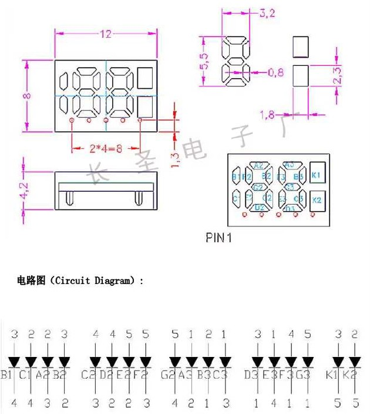
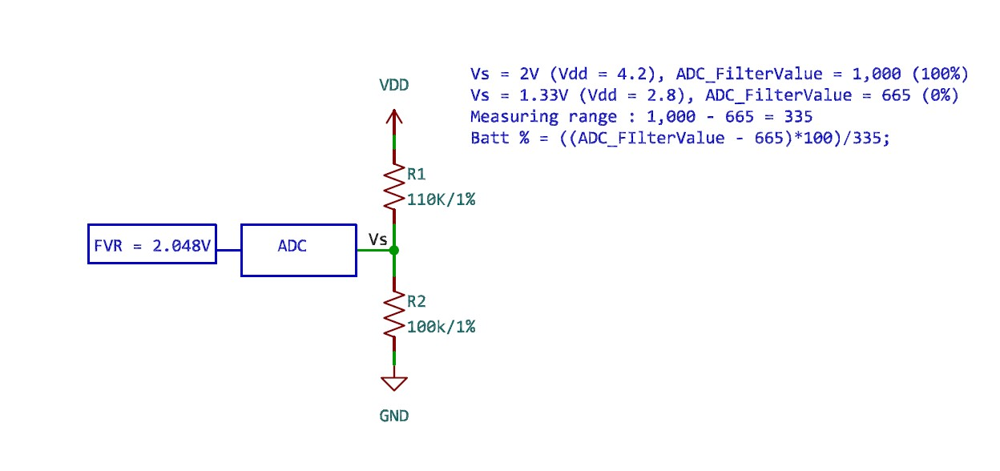

# test_5PinDisplay_16F13145

## Structure

| Path                                         | Purpose                                                                                                                             |
|----------------------------------------------|-------------------------------------------------------------------------------------------------------------------------------------|
| _build                                       | The [CMake build tree](https://cmake.org/cmake/help/latest/manual/cmake.1.html#introduction-to-cmake-buildsystems), can be deleted. |
| cmake                                        | Generated [CMake](https://cmake.org/) files. May be deleted if user.cmake has not been added                                        |
| .vscode                                      | See [VSCode](https://code.visualstudio.com/docs/getstarted/settings)                                                                |
| .vscode\settings.json                        | Workspace specific settings                                                                                                         |
| .vscode\test_5PinDisplay_16F13145.mplab.json | The MPLAB project file, should not be deleted                                                                                       |
| out                                          | Final build artifacts                                                                                                               |

可顯示 188 + % + 充電符的顯使器腳位，本次錦驅動 '%', 未驅動充電符。 
**注意腳位的電阻匹配，以免超出 MCU 電流驅動能力** 

ADC 使用 computation mode 的 Low-pass mode, DSEN = 0, ADRPT = 8, CRS = 5. 
ADC 使用 TMR0 計時, 每 30 msec 轉換一次。 
ADC positive Reference 使用 FVR_buffer1 (2.048V) 
